# Multi-Agent Patterns: Practical Guide

## Visual Pattern Progression

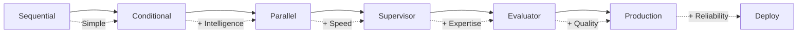

## Quick Pattern Selection

| If you need...            | Use this pattern |
| ------------------------- | ---------------- |
| Step-by-step execution    | **Sequential**   |
| Retry until quality met   | **Conditional**  |
| Speed via parallelism     | **Parallel**     |
| Dynamic expert selection  | **Supervisor**   |
| Iterative refinement      | **Evaluator**    |
| Error recovery & approval | **Production**   |

## Pattern 1: Sequential Workflow

- **When to use**: Tasks with fixed steps that must run in order
- **File**: `01_sequential_workflow.py`
- **Description**: Linear pipeline: coder → reviewer → refactorer
- **Best for**: Simple, predictable workflows
- **Complexity**: Low
- **Execution**: Fast
- **Use cases**: Basic automation, Simple validation, Learning LangGraph


```python
# Key structure
builder.add_edge(START, "coder")
builder.add_edge("coder", "reviewer")
builder.add_edge("reviewer", "refactorer")
builder.add_edge("refactorer", END)
```

**Real example**: Code generation → Review → Refactor <br /> <br />

**Pros**: Simple, predictable, easy to debug <br />
**Cons**: No parallelism, no dynamic routing <br />

## Pattern 2: Conditional Routing

- **When to use**: Need different paths based on quality/conditions
- **File**: `02_conditional_routing.py`
- **Description**: Quality-based routing with improvement loops
- **Best for**: Quality-dependent workflows
- **Complexity**: Medium
- **Execution**: Variable
- **Use cases**: Content moderation, Quality assurance, Iterative improvement

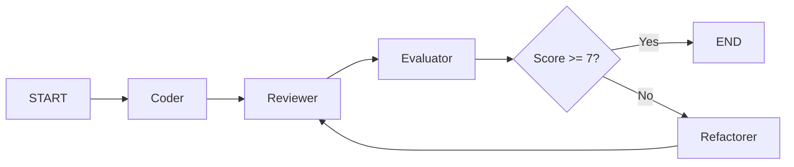

```python
# Key structure
def quality_gate(state):
    return "done" if state["score"] >= 7 else "improve"

builder.add_conditional_edges("evaluator", quality_gate,
    {"improve": "refactorer", "done": END})
```

**Real example**: Keep improving code until quality score ≥ 7 <br /> <br />

**Pros**: Ensures quality standards, adaptive flow <br />
**Cons**: Can loop indefinitely without max iterations <br />

## Pattern 3: Parallel Processing

- **When to use**: Multiple independent analyses needed
- **File**: `03_parallel_processing.py`
- **Description**: Concurrent analysis by multiple specialists
- **Best for**: Independent, parallelisable tasks
- **Complexity**: Medium
- **Execution**: Fast (parallel)
- **Use cases**: Document processing, Multi-aspect analysis, Performance optimisation

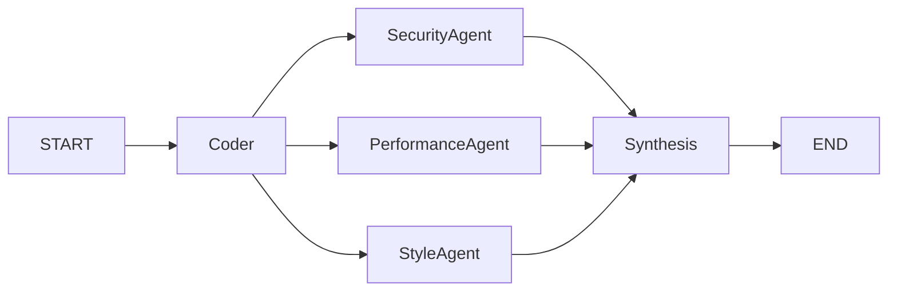

```python
# Key structure
builder.add_edge("coder", "security_agent")
builder.add_edge("coder", "performance_agent")
builder.add_edge("coder", "style_agent")
# All run simultaneously
```

**Real example**: Security, performance, and style checks running concurrently <br /> <br />

**Pros**: Faster execution, independent failures <br />
**Cons**: Harder to debug, needs result aggregation <br />

## Pattern 4: Supervisor Agents

- **When to use**: Dynamic expert selection based on content
- **File**: `04_supervisor_agents.py`
- **Description**: Intelligent coordination of specialist agents
- **Best for**: Complex tasks requiring expertise
- **Complexity**: High
- **Execution**: Efficient
- **Use cases**: Complex analysis, Domain expertise, Dynamic workflows

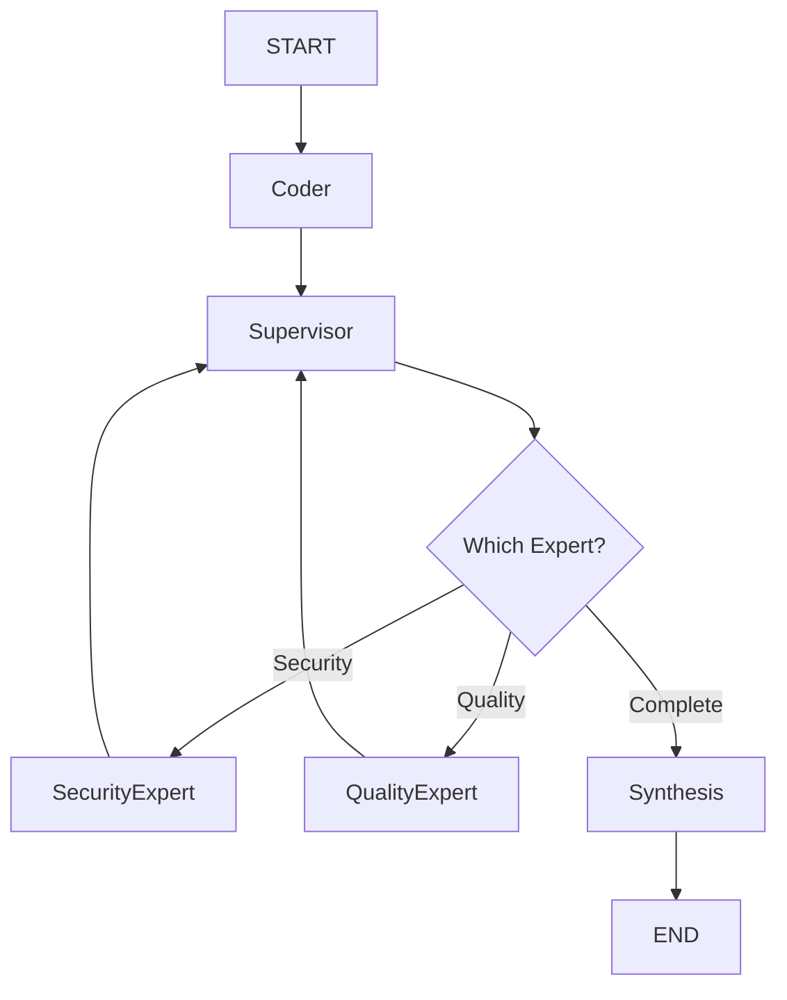

```python
# Key structure
def route_to_expert(state):
    if "security" in state["needs"]:
        return "security_expert"
    elif "performance" in state["needs"]:
        return "performance_expert"
```

**Real example**: Supervisor analyses code, routes to relevant experts only <br /> <br />

**Pros**: Efficient expert usage, intelligent routing <br />
**Cons**: Complex supervisor logic, coordination overhead <br />

## Pattern 5: Evaluator-Optimiser

- **When to use**: Output quality improves with iteration
- **File**: `05_evaluator_optimiser.py`
- **Description**: Continuous improvement through feedback loops
- **Best for**: Iteratively improvable outputs
- **Complexity**: High
- **Execution**: Slow (iterative)
- **Use cases**: Content generation, Optimisation tasks, Quality refinement

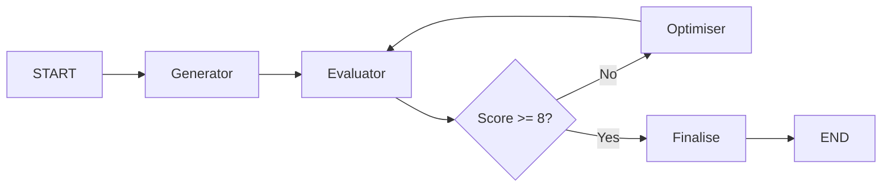

```python
# Key structure
def should_continue(state):
    if state["score"] >= 8 or state["iterations"] >= 3:
        return "finalise"
    return "optimise"
```

**Real example**: Generate → Evaluate → Optimise loop until quality met <br /> <br />

**Pros**: Continuous improvement, clear termination <br />
**Cons**: Slow, may hit iteration limit before quality <br />

## Pattern 6: Production Ready

- **When to use**: Real deployment with error handling needed
- **File**: `06_production_ready.py`
- **Description**: Enterprise features: error handling, persistence, monitoring
- **Best for**: Real-world deployment
- **Complexity**: Very High
- **Execution**: Robust
- **Use cases**: Production systems, Enterprise deployment, Mission-critical tasks

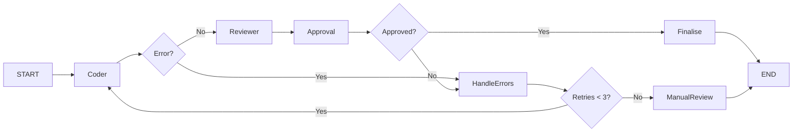

```python
# Key structure
def check_approval(state):
    if state["approved"]:
        return "deploy"
    if state["retries"] < 3:
        return "retry"
    return "manual_review"
```

**Real example**: Code → Review → Approval with retry logic <br /> <br />

**Pros**: Handles failures, audit trail, approval gates <br />
**Cons**: Complex state management, slower execution <br />

## Key Implementation Differences

### Simple vs Full Patterns

**Simple** (`patterns_simple/`):

- Minimal state
- Basic prompts
- Direct execution
- No output generation

**Full** (`patterns/`):

- State management
- Detailed prompts
- Utils for output generation
- Audit trails

### State Management Evolution

```python
# Simple
class State(TypedDict):
    input: str
    code: str

# Full
class State(TypedDict):
    input: str
    code: str
    review: str
    refactored_code: str
    iteration_count: int
    quality_score: int
```

## Pattern Complexity Comparison

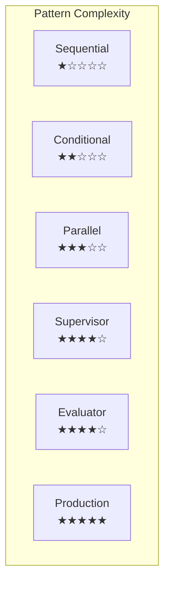

## Combining Patterns

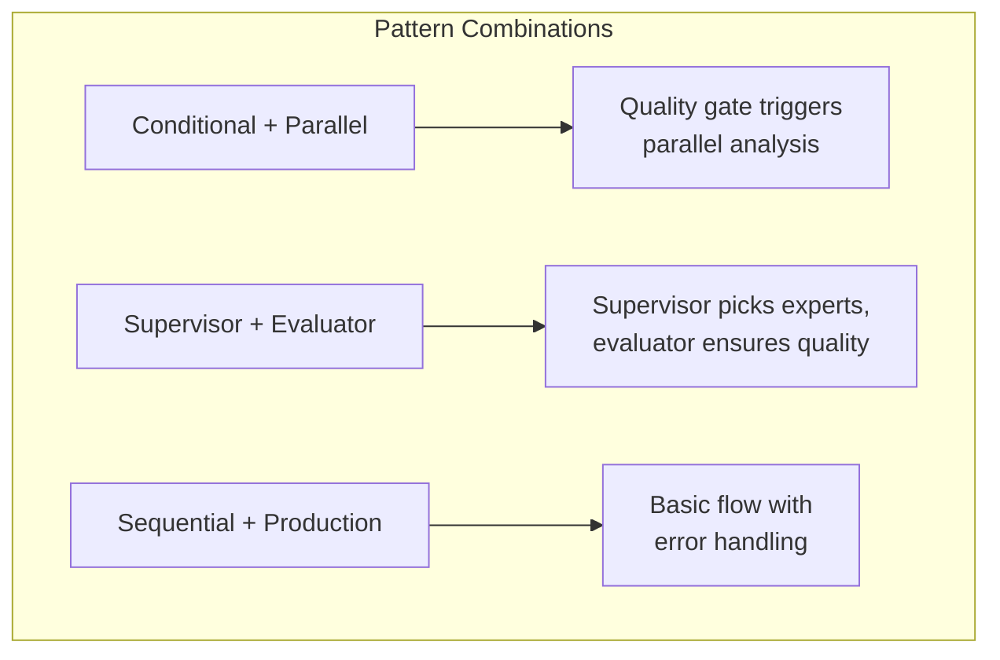

Patterns can be mixed:

1. **Conditional + Parallel**: Quality gate triggers parallel analysis
2. **Supervisor + Evaluator**: Supervisor picks experts, evaluator ensures quality
3. **Sequential + Production**: Basic flow with error handling

## Pattern Evolution

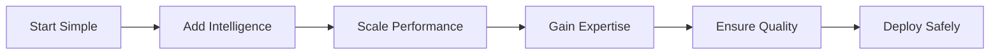

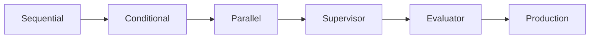

### Evolution Principles

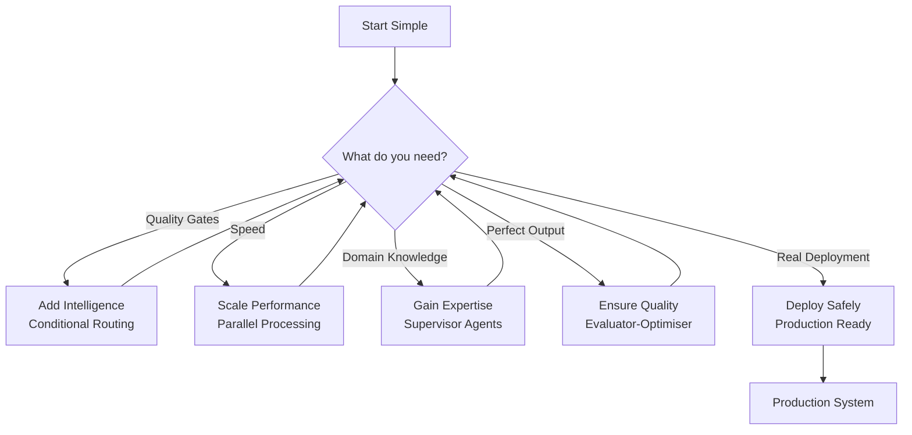

## Decision Matrix

| Scenario                          | Recommended Pattern | Complexity | Execution Time | Reason                                                 |
| --------------------------------- | ------------------- | ---------- | -------------- | ------------------------------------------------------ |
| Simple blog post review           | Sequential          | Low        | Fast           | Predictable workflow, no complex logic needed          |
| Code security analysis            | Parallel Processing | Medium     | Fast           | Multiple independent analyses can run concurrently     |
| Complex enterprise system review  | Supervisor Agents   | High       | Efficient      | Requires domain expertise and intelligent coordination |
| Creative content generation       | Evaluator-Optimiser | High       | Slow           | Benefits from iterative feedback and improvement       |
| Mission-critical financial system | Production Ready    | Very High  | Robust         | Requires robust error handling and monitoring          |
| Learning/prototyping              | Sequential          | Low        | Fast           | Simple to understand and implement                     |
| Quality assurance pipeline        | Conditional Routing | Medium     | Variable       | Quality gates determine workflow paths                 |
| Document processing at scale      | Parallel Processing | Medium     | Fast           | Independent tasks benefit from concurrency             |
| Multi-domain analysis             | Supervisor Agents   | High       | Efficient      | Dynamic expert selection based on content              |
| AI content refinement             | Evaluator-Optimiser | High       | Slow           | Continuous improvement through feedback                |

## Implementation Guide

1. **Always start with Sequential** for prototyping
2. **Add Conditional routing** when you need quality gates
3. **Use Parallel** when you have independent tasks
4. **Employ Supervisor** for complex domain-specific tasks
5. **Add Evaluator-Optimiser** for quality-critical outputs
6. **Implement Production patterns** for real deployment

### Decision Framework

Ask yourself:

1. **Is order important?** → Sequential
2. **Need quality assurance?** → Conditional or Evaluator
3. **Can tasks run together?** → Parallel
4. **Need smart coordination?** → Supervisor
5. **Deploying to production?** → Production Ready

Start simple, add complexity only when needed.

### Anti-Patterns

❌ Using Supervisor for simple linear tasks<br />
❌ Parallel processing for sequential dependencies<br />
❌ Evaluator-Optimiser for time-critical tasks<br />
❌ Sequential for complex multi-domain problems<br />
❌ Skipping Production patterns for real deployment<br />

### Common Pitfalls

1. **Using Supervisor for simple tasks** - Overkill, use Sequential
2. **Parallel without aggregation** - Results get lost
3. **Conditional without max iterations** - Infinite loops
4. **Evaluator for time-critical tasks** - Too slow
5. **Skipping Production for real deployment** - No error recovery

## Performance Comparison

| Pattern             | Latency | Complexity   | Scalability |
| ------------------- | ------- | ------------ | ----------- |
| Sequential          | 1x      | O(n)         | Linear      |
| Conditional         | 1-3x    | O(n\*k)      | Variable    |
| Parallel            | 0.3x    | O(n)         | Horizontal  |
| Supervisor          | 1.2x    | O(n\*log(n)) | Intelligent |
| Evaluator-Optimiser | 3-10x   | O(n²)        | Iterative   |
| Production          | 1.5x    | O(n)         | Robust      |

## Workshop Exercise Patterns

Each pattern file follows this structure:

1. **Imports and setup**
2. **State definition** - What data flows through
3. **Agent functions** - The work each node does
4. **Routing logic** - How decisions are made
5. **Graph construction** - Connecting nodes
6. **Execution** - Running with sample input

When modifying for exercises:

- Add agents: Define function, add node, add edge
- Change routing: Modify conditional functions
- Adjust thresholds: Change magic numbers
- Add features: Extend state, update agents
