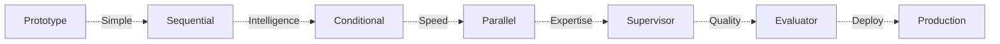
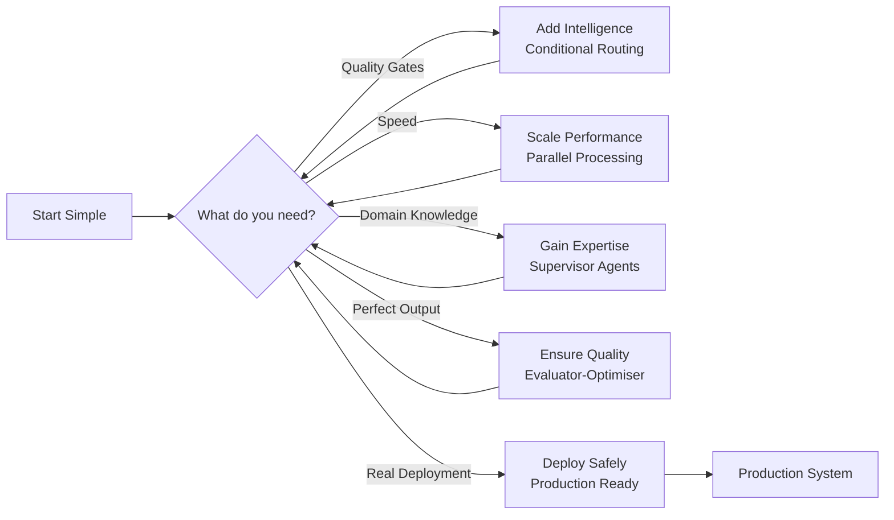
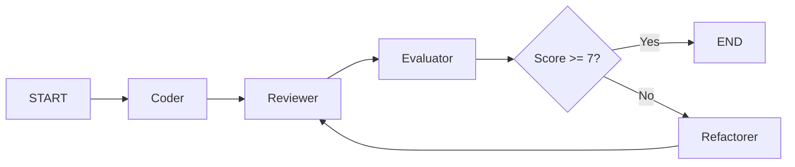
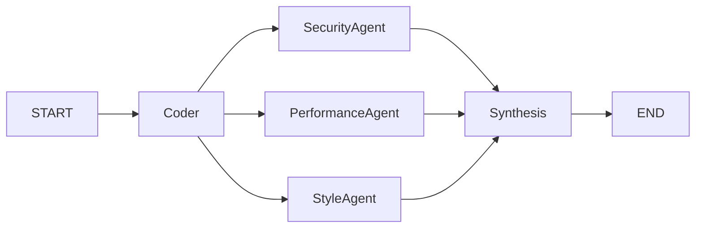
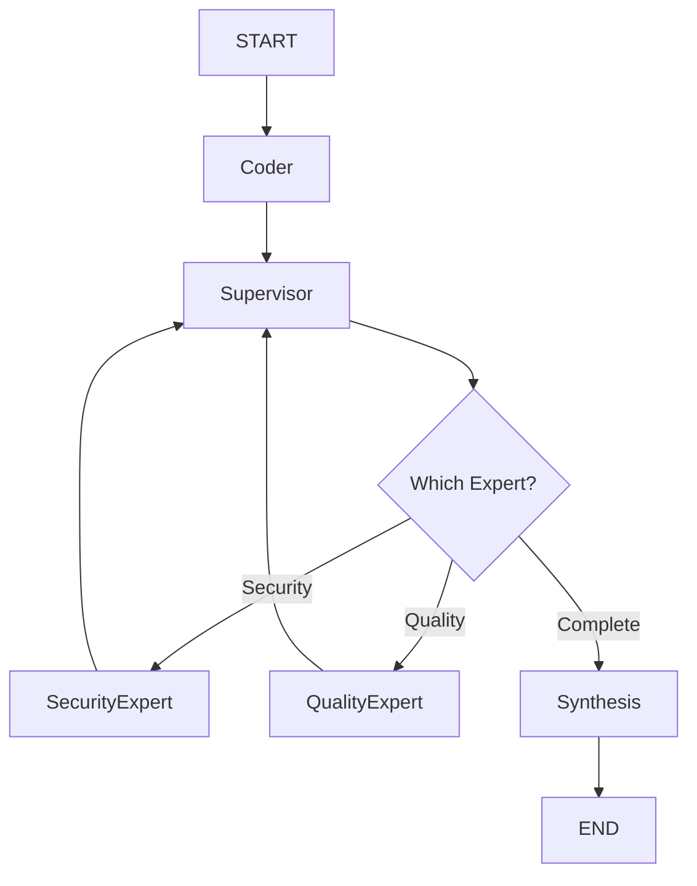
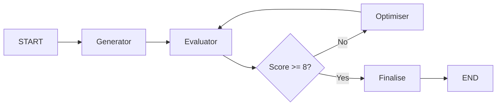
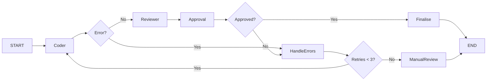
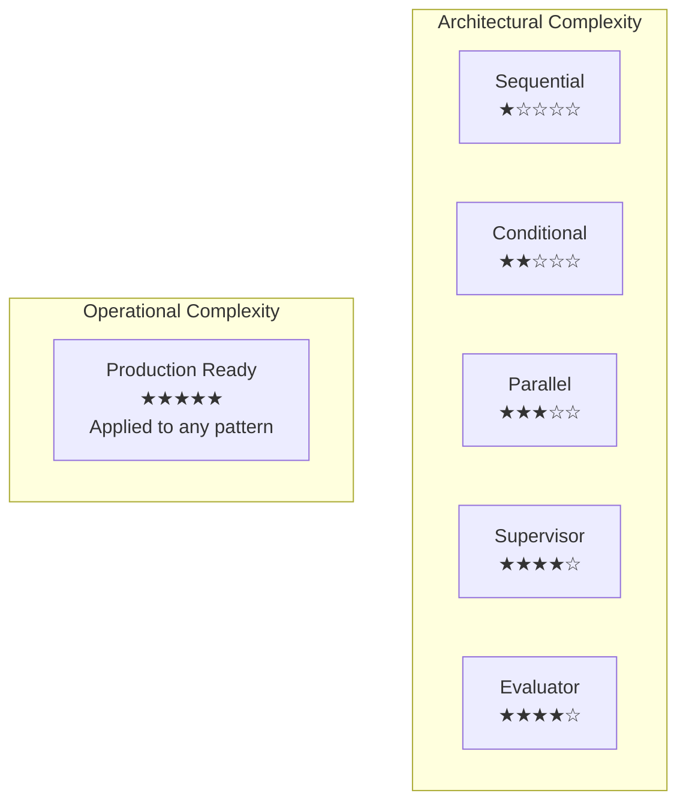
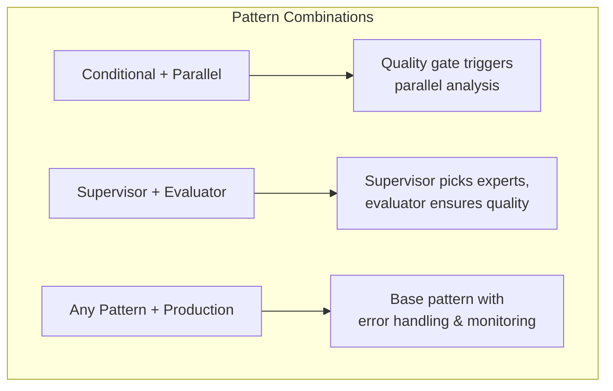

# Multi-Agent Patterns: Practical Guide

## Visual Pattern Progression



### Pattern Decision Logic



## Pattern 1: Sequential Workflow

- **When to use**: Tasks with fixed steps that must run in order
- **Workflow**: [Prompt chaining](https://www.anthropic.com/engineering/building-effective-agents#workflow-prompt-chaining)
- **File**: `01_sequential_workflow.py`
- **Description**: Linear pipeline: coder → reviewer → refactorer
- **Best for**: Simple, predictable workflows
- **Complexity**: Low
- **Execution**: Fast
- **Use cases**: Basic automation, Simple validation, Learning LangGraph


```python
# Key structure
builder.add_edge(START, "coder")
builder.add_edge("coder", "reviewer")
builder.add_edge("reviewer", "refactorer")
builder.add_edge("refactorer", END)
```

**Real example**: Code generation → Review → Refactor <br /> <br />

**Pros**: Simple, predictable, easy to debug <br />
**Cons**: No parallelism, no dynamic routing <br />

## Pattern 2: Conditional Routing

- **When to use**: Need different paths based on quality/conditions
- **Workflow**: [Routing](https://www.anthropic.com/engineering/building-effective-agents#workflow-routing)
- **File**: `02_conditional_routing.py`
- **Description**: Quality-based routing with improvement loops
- **Best for**: Quality-dependent workflows
- **Complexity**: Medium
- **Execution**: Variable
- **Use cases**: Content moderation, Quality assurance, Iterative improvement



```python
# Key structure
def quality_gate(state):
    return "done" if state["score"] >= 7 else "improve"

builder.add_conditional_edges("evaluator", quality_gate,
    {"improve": "refactorer", "done": END})
```

**Real example**: Keep improving code until quality score ≥ 7 <br /> <br />

**Pros**: Ensures quality standards, adaptive flow <br />
**Cons**: Can loop indefinitely without max iterations <br />

## Pattern 3: Parallel Processing

- **When to use**: Multiple independent analyses needed
- **Workflow**: [Parallelisation](https://www.anthropic.com/engineering/building-effective-agents#workflow-parallelization)
- **File**: `03_parallel_processing.py`
- **Description**: Concurrent analysis by multiple specialists
- **Best for**: Independent, parallelisable tasks
- **Complexity**: Medium
- **Execution**: Fast (parallel)
- **Use cases**: Document processing, Multi-aspect analysis, Performance optimisation



```python
# Key structure
builder.add_edge("coder", "security_agent")
builder.add_edge("coder", "performance_agent")
builder.add_edge("coder", "style_agent")
# All run simultaneously
```

**Real example**: Security, performance, and style checks running concurrently <br /> <br />

**Pros**: Faster execution, independent failures <br />
**Cons**: Harder to debug, needs result aggregation <br />

## Pattern 4: Supervisor Agents

- **When to use**: Dynamic expert selection based on content
- **Workflow**: [Orchestrator-Workers](https://www.anthropic.com/engineering/building-effective-agents#workflow-orchestrator-workers)
- **File**: `04_supervisor_agents.py`
- **Description**: Intelligent coordination of specialist agents
- **Best for**: Complex tasks requiring expertise
- **Complexity**: High
- **Execution**: Efficient
- **Use cases**: Complex analysis, Domain expertise, Dynamic workflows



```python
# Key structure
def route_to_expert(state):
    if "security" in state["needs"]:
        return "security_expert"
    elif "performance" in state["needs"]:
        return "performance_expert"
```

**Real example**: Supervisor analyses code, routes to relevant experts only <br /> <br />

**Pros**: Efficient expert usage, intelligent routing <br />
**Cons**: Complex supervisor logic, coordination overhead <br />

## Pattern 5: Evaluator-Optimiser

- **When to use**: Output quality improves with iteration
- **Workflow**: [Evaluator-Optimiser](https://www.anthropic.com/engineering/building-effective-agents#workflow-evaluator-optimizer)
- **File**: `05_evaluator_optimiser.py`
- **Description**: Continuous improvement through feedback loops
- **Best for**: Iteratively improvable outputs
- **Complexity**: High
- **Execution**: Slow (iterative)
- **Use cases**: Content generation, Optimisation tasks, Quality refinement



```python
# Key structure
def should_continue(state):
    if state["score"] >= 8 or state["iterations"] >= 3:
        return "finalise"
    return "optimise"
```

**Real example**: Generate → Evaluate → Optimise loop until quality met <br /> <br />

**Pros**: Continuous improvement, clear termination <br />
**Cons**: Slow, may hit iteration limit before quality <br />

## Production Ready Implementation

- **When to use**: Real deployment with error handling needed, appended to your multi-agent system
- **File**: `06_production_ready.py`
- **Description**: Enterprise features: error handling, persistence, monitoring
- **Best for**: Real-world deployment
- **Complexity**: Very High
- **Execution**: Robust
- **Use cases**: Production systems, Enterprise deployment, Mission-critical tasks



```python
# Key structure
def check_approval(state):
    if state["approved"]:
        return "deploy"
    if state["retries"] < 3:
        return "retry"
    return "manual_review"
```

**Real implementation**: ANY pattern + error handling + retries + approval gates <br /> <br />

**What it adds**:

- Error handling and recovery
- Retry mechanisms with backoff
- Approval workflows
- State persistence
- Monitoring and logging
- Circuit breakers
- Rollback capabilities

**Important**: This is NOT a distinct architectural pattern but a set of concerns you apply to patterns 1-5 for production deployment

## Pattern Complexity & Performance



| Pattern            | Latency | Reliability | Use When                   |
| ------------------ | ------- | ----------- | -------------------------- |
| Sequential         | 1x      | High        | Order matters              |
| Conditional        | 1-3x    | Medium      | Quality gates needed       |
| Parallel           | 0.3x    | Medium      | Speed critical             |
| Supervisor         | 1.2x    | High        | Complex coordination       |
| Evaluator          | 3-10x   | High        | Quality critical           |
| + Production Ready | +50%    | Very High   | Deploying ANY pattern live |

## Combining Patterns



Patterns can be mixed:

1. **Conditional + Parallel**: Quality gate triggers parallel analysis
2. **Supervisor + Evaluator**: Supervisor picks experts, evaluator ensures quality
3. **Any Pattern + Production**: Add operational concerns to any architecture

## Implementation Guide

### Decision Matrix

| Scenario                          | Recommended Pattern | Complexity | Execution Time | Reason                                                 |
| --------------------------------- | ------------------- | ---------- | -------------- | ------------------------------------------------------ |
| Simple blog post review           | Sequential          | Low        | Fast           | Predictable workflow, no complex logic needed          |
| Code security analysis            | Parallel Processing | Medium     | Fast           | Multiple independent analyses can run concurrently     |
| Complex enterprise system review  | Supervisor Agents   | High       | Efficient      | Requires domain expertise and intelligent coordination |
| Creative content generation       | Evaluator-Optimiser | High       | Slow           | Benefits from iterative feedback and improvement       |
| Mission-critical financial system | Production Ready    | Very High  | Robust         | Requires robust error handling and monitoring          |
| Learning/prototyping              | Sequential          | Low        | Fast           | Simple to understand and implement                     |
| Quality assurance pipeline        | Conditional Routing | Medium     | Variable       | Quality gates determine workflow paths                 |
| Document processing at scale      | Parallel Processing | Medium     | Fast           | Independent tasks benefit from concurrency             |
| Multi-domain analysis             | Supervisor Agents   | High       | Efficient      | Dynamic expert selection based on content              |
| AI content refinement             | Evaluator-Optimiser | High       | Slow           | Continuous improvement through feedback                |

### Simple vs Full Patterns

**Simple** (`patterns_simple/`):

- Minimal state
- Basic prompts
- Direct execution
- No output generation

**Full** (`patterns/`):

- Rich state management
- Detailed prompts
- Utils for output generation
- Audit trails

### State Management Evolution

```python
# Simple
class State(TypedDict):
    input: str
    code: str

# Full
class State(TypedDict):
    input: str
    code: str
    review: str
    refactored_code: str
    iteration_count: int
    quality_score: int

# Production (adds to any pattern)
class ProductionState(TypedDict):
    # ... existing state fields ...
    retry_count: int
    error_log: str
    approved: bool
    rollback_state: dict
```

### Common Pitfalls

❌ **Using Supervisor for simple tasks** - Overkill, use Sequential <br />
❌ **Parallel without aggregation** - Results get lost <br />
❌ **Conditional without max iterations** - Infinite loops <br />
❌ **Evaluator for time-critical tasks** - Too slow <br />
❌ **Deploying without production concerns** - No error recovery <br />

### Decision Framework

Ask yourself:

1. **Is order important?** → Sequential
2. **Need quality assurance?** → Conditional or Evaluator
3. **Can tasks run together?** → Parallel
4. **Need smart coordination?** → Supervisor
5. **Deploying to production?** → Add Production concerns to chosen pattern

Start simple, add complexity only when needed. Add production concerns before deploying.
