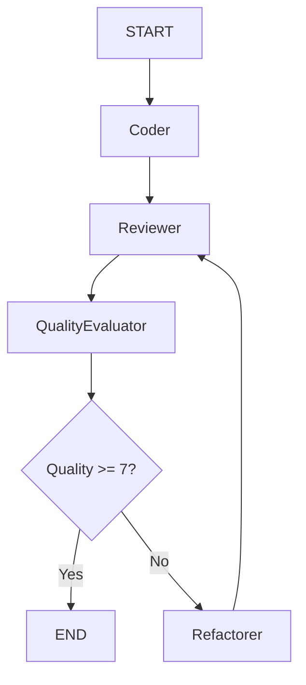
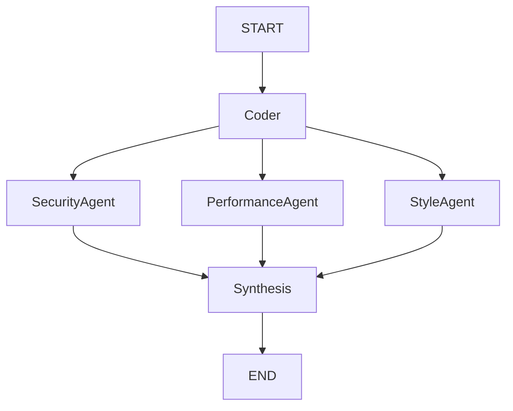
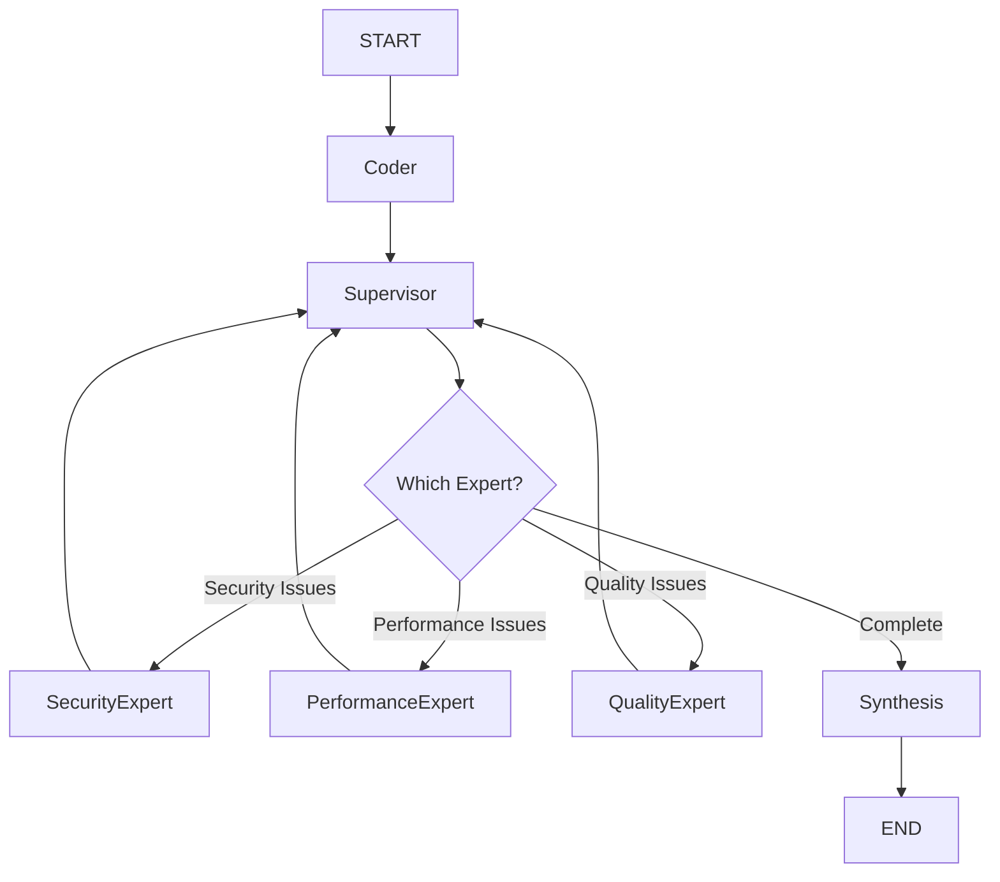
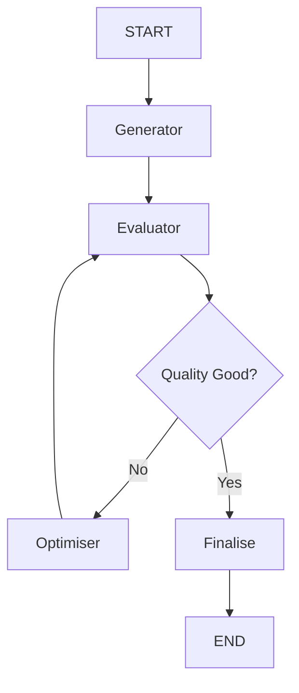
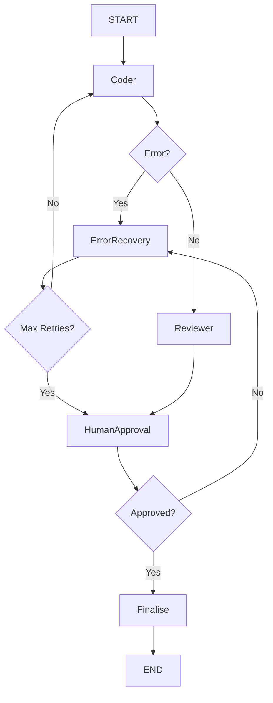
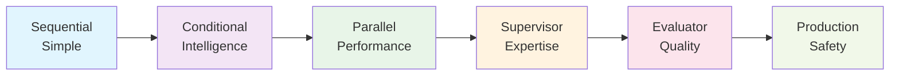
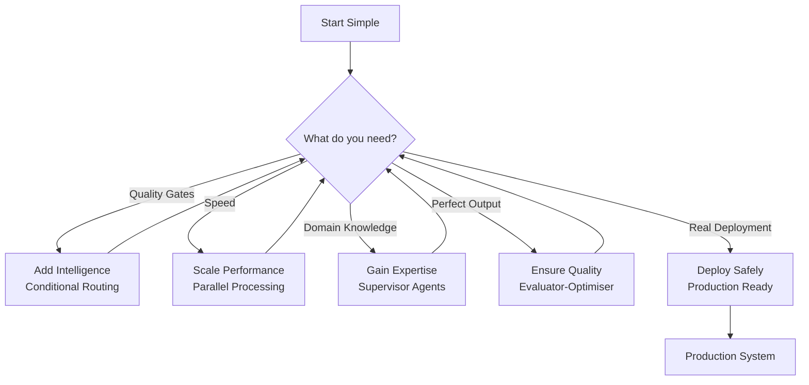

# LangGraph Pattern Comparison Guide

## Pattern Overview

### Sequential Workflow
- **File**: `01_sequential_workflow.py`
- **Description**: Linear pipeline: coder → reviewer → refactorer
- **Best for**: Simple, predictable workflows
- **Complexity**: Low
- **Execution**: Fast
- **Use cases**: Basic automation, Simple validation, Learning LangGraph

### Conditional Routing
- **File**: `02_conditional_routing.py`
- **Description**: Quality-based routing with improvement loops
- **Best for**: Quality-dependent workflows
- **Complexity**: Medium
- **Execution**: Variable
- **Use cases**: Content moderation, Quality assurance, Iterative improvement

### Parallel Processing
- **File**: `03_parallel_processing.py`
- **Description**: Concurrent analysis by multiple specialists
- **Best for**: Independent, parallelisable tasks
- **Complexity**: Medium
- **Execution**: Fast (parallel)
- **Use cases**: Document processing, Multi-aspect analysis, Performance optimisation

### Supervisor Agents
- **File**: `04_supervisor_agents.py`
- **Description**: Intelligent coordination of specialist agents
- **Best for**: Complex tasks requiring expertise
- **Complexity**: High
- **Execution**: Efficient
- **Use cases**: Complex analysis, Domain expertise, Dynamic workflows

### Evaluator-Optimiser
- **File**: `05_evaluator_optimiser.py`
- **Description**: Continuous improvement through feedback loops
- **Best for**: Iteratively improvable outputs
- **Complexity**: High
- **Execution**: Slow (iterative)
- **Use cases**: Content generation, Optimisation tasks, Quality refinement

### Production Ready
- **File**: `06_production_ready.py`
- **Description**: Enterprise features: error handling, persistence, monitoring
- **Best for**: Real-world deployment
- **Complexity**: Very High
- **Execution**: Robust
- **Use cases**: Production systems, Enterprise deployment, Mission-critical tasks

## Decision Matrix

| Scenario | Recommended Pattern | Complexity | Execution Time | Reason |
|----------|-------------------|------------|----------------|---------|
| Simple blog post review | Sequential | Low | Fast | Predictable workflow, no complex logic needed |
| Code security analysis | Parallel Processing | Medium | Fast | Multiple independent analyses can run concurrently |
| Complex enterprise system review | Supervisor Agents | High | Efficient | Requires domain expertise and intelligent coordination |
| Creative content generation | Evaluator-Optimiser | High | Slow | Benefits from iterative feedback and improvement |
| Mission-critical financial system | Production Ready | Very High | Robust | Requires robust error handling and monitoring |
| Learning/prototyping | Sequential | Low | Fast | Simple to understand and implement |
| Quality assurance pipeline | Conditional Routing | Medium | Variable | Quality gates determine workflow paths |
| Document processing at scale | Parallel Processing | Medium | Fast | Independent tasks benefit from concurrency |
| Multi-domain analysis | Supervisor Agents | High | Efficient | Dynamic expert selection based on content |
| AI content refinement | Evaluator-Optimiser | High | Slow | Continuous improvement through feedback |

## Pattern Evolution

### Evolution Principles

## Implementation Guide

1. **Always start with Sequential** for prototyping
2. **Add Conditional routing** when you need quality gates
3. **Use Parallel** when you have independent tasks
4. **Employ Supervisor** for complex domain-specific tasks
5. **Add Evaluator-Optimiser** for quality-critical outputs
6. **Implement Production patterns** for real deployment

## Anti-Patterns

❌ Using Supervisor for simple linear tasks
❌ Parallel processing for sequential dependencies
❌ Evaluator-Optimiser for time-critical tasks
❌ Sequential for complex multi-domain problems
❌ Skipping Production patterns for real deployment

## Performance Comparison

| Pattern                | Latency | Complexity   | Scalability  |
|------------------------|---------|--------------|--------------|
| Sequential             | 1x      | O(n)         | Linear       |
| Conditional            | 1-3x    | O(n*k)       | Variable     |
| Parallel               | 0.3x    | O(n)         | Horizontal   |
| Supervisor             | 1.2x    | O(n*log(n))  | Intelligent  |
| Evaluator-Optimiser    | 3-10x   | O(n²)        | Iterative    |
| Production             | 1.5x    | O(n)         | Robust       |

## Next Steps

1. Run each pattern file to see them in action
2. Experiment with modifying prompts and logic
3. Combine patterns for your specific use case
4. Deploy using LangGraph Platform for production